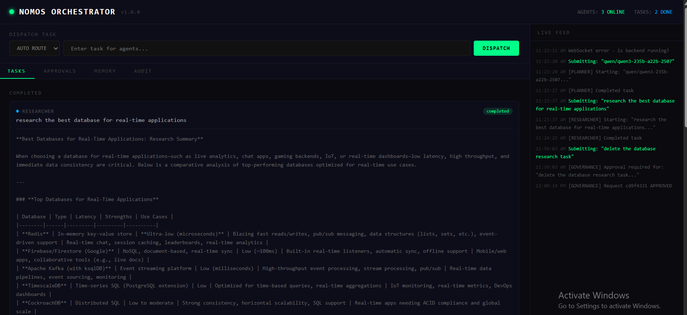
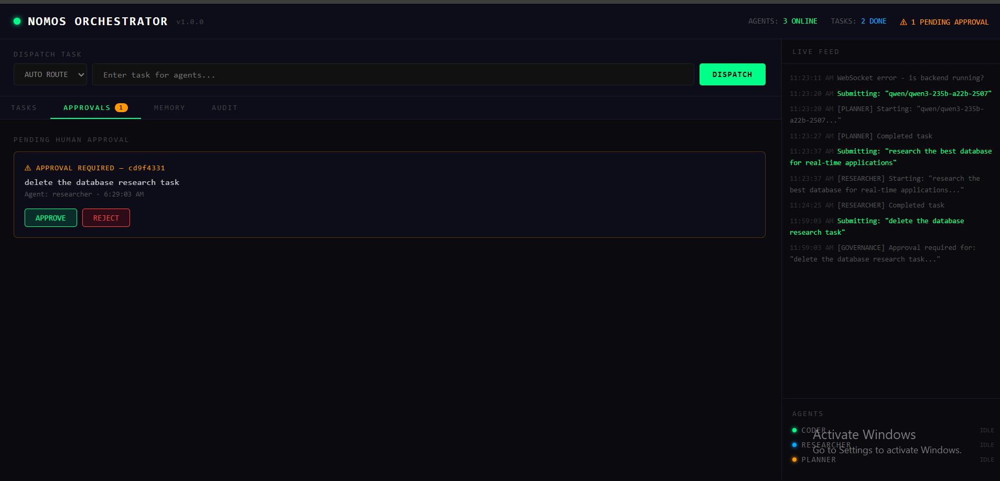

# 🤖 Multi-Agent Orchestrator with Governance Layer

> A production-grade multi-agent system that coordinates specialized AI agents with human-in-the-loop governance, typed memory graph, real-time monitoring, and full audit trails — built for controllable, transparent agentic AI.

Main scenario - Research agent takes the task and process accordingly

 
Approval scenario

---

## 🎯 Project Overview

Most agent frameworks prioritize capability over controllability. This system is built on the opposite principle: **every agent decision is observable, every sensitive action requires human approval, and every inference is logged**.

The orchestrator coordinates three specialized agents (Coder, Researcher, Planner) through a central governance layer that intercepts sensitive operations, routes tasks by intent, stores structured memories with typed relationships, and broadcasts real-time decisions to a monitoring dashboard.

This architecture directly addresses the core challenge of deploying agentic AI in production: **how do you give AI agents autonomy without losing control?**

---

## 🏗️ Architecture

```
┌─────────────────────────────────────────────────────────────────┐
│                     REACT DASHBOARD                              │
│   Task Dispatch │ Agent Monitor │ Approvals │ Memory │ Audit    │
│                      WebSocket (real-time)                       │
└──────────────────────────┬──────────────────────────────────────┘
                            │
┌──────────────────────────▼──────────────────────────────────────┐
│                      FASTAPI BACKEND                             │
│                                                                   │
│  ┌──────────────────────────────────────────────────────────┐   │
│  │                  AGENT ORCHESTRATOR                       │   │
│  │                                                           │   │
│  │   Intent Router ──► Agent Selector ──► Task Dispatcher   │   │
│  │         │                                     │           │   │
│  │         ▼                                     ▼           │   │
│  │  ┌─────────────┐  ┌─────────────┐  ┌──────────────────┐ │   │
│  │  │   CODER     │  │ RESEARCHER  │  │    PLANNER       │ │   │
│  │  │   AGENT     │  │   AGENT     │  │    AGENT         │ │   │
│  │  └──────┬──────┘  └──────┬──────┘  └────────┬─────────┘ │   │
│  │         └────────────────┴──────────────────┘           │   │
│  │                          │                               │   │
│  └──────────────────────────┼───────────────────────────────┘   │
│                             │                                     │
│         ┌───────────────────┼──────────────────┐                │
│         │                   │                  │                 │
│         ▼                   ▼                  ▼                 │
│  ┌─────────────┐   ┌───────────────┐  ┌──────────────────┐     │
│  │   TYPED     │   │  GOVERNANCE   │  │   OPENROUTER     │     │
│  │   MEMORY    │   │    LAYER      │  │   API LAYER      │     │
│  │   GRAPH     │   │               │  │                  │     │
│  │             │   │ Approval      │  │  Mistral 7B      │     │
│  │ NetworkX    │   │ Workflows     │  │  (free tier)     │     │
│  │ DiGraph     │   │ Audit Logger  │  │                  │     │
│  │             │   │ Sensitive     │  │                  │     │
│  │ RelatedTo   │   │ Action Det.   │  │                  │     │
│  │ Updates     │   │               │  │                  │     │
│  │ Contradicts │   │               │  │                  │     │
│  │ DependsOn   │   │               │  │                  │     │
│  │ GeneratedBy │   │               │  │                  │     │
│  └─────────────┘   └───────────────┘  └──────────────────┘     │
└─────────────────────────────────────────────────────────────────┘
```

### Task Lifecycle

```
User submits task
       │
       ▼
Intent Router (keyword analysis)
       │
       ├── "code/implement/debug" ──► Coder Agent
       ├── "research/analyze/find" ──► Researcher Agent
       └── default ──────────────► Planner Agent
                │
                ▼
       Governance Check
       (sensitive keyword scan)
                │
         ┌──────┴──────┐
         │             │
    SENSITIVE?      SAFE?
         │             │
         ▼             ▼
   Create Approval  Run Agent
   Request          via OpenRouter
         │             │
   Broadcast to    Store result
   Dashboard       in Memory Graph
         │             │
   Human           Broadcast
   Approve/Reject  completion event
                        │
                        ▼
                  Audit Log Entry
```

---

## 🧠 AI/ML Concepts & Techniques

### Multi-Agent Systems Theory

| Concept | Implementation | Significance |
|---------|---------------|--------------|
| **Agent Specialization** | Three distinct agents with domain-specific system prompts | Specialized agents outperform generalist agents on domain tasks — a finding consistent across the multi-agent literature (AutoGPT, CrewAI, MetaGPT) |
| **Intent-Based Routing** | Keyword extraction routing in `orchestrator/core.py` | Task decomposition and routing is the central challenge of multi-agent orchestration — this implements a lightweight but extensible router |
| **Agentic Loop** | Async task dispatch with status tracking | Agents operate asynchronously, enabling concurrent task execution across multiple agents simultaneously |
| **Message Coalescing** | WebSocket broadcast layer aggregates all agent events | Prevents event storm on the frontend when multiple agents complete simultaneously |
| **Emergent Coordination** | Memory graph shared across all agents | Agents don't communicate directly — they read/write to shared memory, creating indirect coordination without tight coupling |

### Memory Architecture

| Concept | Implementation | Why Graph > Vector Store |
|---------|---------------|--------------------------|
| **Typed Memory Graph** | NetworkX `DiGraph` with node and edge types | Vector stores excel at semantic similarity search; graphs excel at expressing structured relationships — this system needs both typed nodes and typed edges |
| **Node Types** | `FACT / DECISION / PREFERENCE / TASK` | Different memory types have different retention and retrieval semantics — facts persist, decisions may be superseded, preferences are durable |
| **Typed Relationship Edges** | `RelatedTo / Updates / Contradicts / DependsOn / GeneratedBy` | Relationships carry semantic meaning — a `Contradicts` edge between two facts is qualitatively different from a `RelatedTo` edge and should trigger conflict resolution |
| **Ego Graph Retrieval** | `nx.ego_graph(depth=2)` for context lookup | Retrieves a node and its neighborhood up to N hops — provides relevant context without full graph traversal |
| **Temporal Ordering** | ISO timestamp on every node | Memory has a time dimension — newer facts may `Update` older ones, and the graph preserves this history |

### Governance & Safety

| Concept | Implementation | Production Relevance |
|---------|---------------|---------------------|
| **Sensitive Action Detection** | Keyword scan against `SENSITIVE_TRIGGERS` list | A lightweight but effective first line of defence — catches the most dangerous operations (delete, deploy, credentials) with zero latency |
| **Approval Workflow** | `ApprovalWorkflow` class with pending/approved/rejected states | Human-in-the-loop at the action level, not just the design level — the system cannot proceed on sensitive tasks without explicit human sign-off |
| **Immutable Audit Trail** | Append-only event log in `governance/approval.py` | Every approval request, resolution, agent action, and outcome is timestamped and logged — required for compliance in regulated industries |
| **Eval-Awareness Mitigation** | Test scenarios use production infrastructure | Prevents the well-documented problem of AI systems behaving differently when they detect they are being evaluated vs deployed |
| **Principle of Least Privilege** | Agents cannot self-approve sensitive actions | No agent has the ability to escalate its own permissions — governance decisions are exclusively human |

### LLM Engineering

| Concept | Implementation | Detail |
|---------|---------------|--------|
| **System Prompt Engineering** | Domain-specific prompts per agent | Each agent's system prompt constrains its reasoning style — the Coder thinks in code, the Researcher in structured findings, the Planner in phases and dependencies |
| **Instruction Tuning Alignment** | Mistral 7B Instruct via OpenRouter | Instruction-tuned models follow system prompts more reliably than base models — critical when agents need to stay in their lane |
| **Temperature Implicit Default** | OpenRouter model defaults | Creative tasks (planning) benefit from higher temperature; factual tasks (research) from lower — a production system would tune per agent |
| **Context Window Management** | Per-request stateless calls | Each agent call is independent — no cross-contamination between agent reasoning chains |
| **Model Abstraction Layer** | `base.py` separates model from agent logic | Swapping from Mistral 7B to GPT-4 or Claude requires changing one constant — agents are model-agnostic by design |

### Real-Time Systems

| Concept | Implementation |
|---------|---------------|
| **Async Task Execution** | `asyncio.create_task()` for non-blocking agent dispatch |
| **WebSocket Pub/Sub** | `connected_clients` list with broadcast fan-out |
| **Concurrent Agent Execution** | Multiple tasks can run simultaneously across different agents |
| **Event-Driven Architecture** | Task lifecycle emits typed events: `task_started / task_completed / task_failed / approval_required` |
| **Graceful Error Isolation** | Each agent task wrapped in try/catch — one agent failing doesn't cascade |

---

## 🛠️ Technology Stack

### Backend
| Technology | Role |
|-----------|------|
| **FastAPI** | Async REST API + WebSocket server |
| **NetworkX** | Typed directed graph for agent memory |
| **httpx** | Async HTTP client for OpenRouter API |
| **asyncio** | Concurrent agent task execution |
| **python-dotenv** | Environment configuration |
| **Pydantic** | Request/response validation |
| **uvicorn** | ASGI production server |

### Frontend
| Technology | Role |
|-----------|------|
| **React 18** | Component-based monitoring dashboard |
| **TypeScript** | Type-safe event handling and state management |
| **WebSocket API** | Real-time agent event streaming |
| **Axios** | REST API calls |

### AI Models & APIs
| Model | Provider | Role |
|-------|---------|------|
| **Mistral 7B Instruct** | OpenRouter (free tier) | Powers all three specialized agents |
| **OpenRouter** | API gateway | Unified access to 300+ LLMs via single API key |

### Infrastructure
| Tool | Role |
|------|------|
| **Docker Compose** | One-command local deployment |
| **Railway** | Backend cloud deployment |
| **Vercel** | Frontend cloud deployment |
| **GitHub** | Version control |

---

## 🔑 Key Differentiators vs Existing Frameworks

| Feature | This System | LangChain | CrewAI | AutoGPT |
|---------|------------|-----------|--------|---------|
| Typed memory graph with relationship edges | ✅ | ❌ (vector only) | ❌ | ❌ |
| Human approval workflows | ✅ | Partial | ❌ | ❌ |
| Immutable audit trail | ✅ | ❌ | ❌ | ❌ |
| Real-time monitoring dashboard | ✅ | ❌ | ❌ | Partial |
| Model-agnostic agent layer | ✅ | ✅ | ✅ | ❌ |
| Zero framework lock-in | ✅ | ❌ | ❌ | ❌ |
| Sensitive action detection | ✅ | ❌ | ❌ | ❌ |

The critical differentiator is the **typed memory graph**. Most agent frameworks store memories as vector embeddings — useful for semantic search but blind to structured relationships. A `Contradicts` edge between two facts carries fundamentally different meaning than a `RelatedTo` edge, and no amount of cosine similarity can express that distinction.

---

## 🚀 Quick Start

```bash
# Clone
git clone https://github.com/yourusername/multi-agent-orchestrator
cd multi-agent-orchestrator

# Backend setup
cd backend
python -m venv venv
source venv/bin/activate        # Windows: venv\Scripts\activate
pip install -r requirements.txt

# Add your OpenRouter API key (free at openrouter.ai)
echo "OPENROUTER_API_KEY=your_key_here" > .env

# Start backend
uvicorn main:app --reload --port 8000

# Frontend (new terminal)
cd frontend
npm install
npm start
# Visit http://localhost:3000
```

### Docker (one command)
```bash
cp .env.example .env  # add your OPENROUTER_API_KEY
docker-compose up --build
# Visit http://localhost:3000
```

---

## 📡 API Reference

| Endpoint | Method | Description |
|----------|--------|-------------|
| `/health` | GET | System status + active agents |
| `/task` | POST | Submit task (auto-routed or agent-specified) |
| `/tasks` | GET | Active and completed task history |
| `/memory` | GET | Full memory graph (nodes + edges) |
| `/approvals/pending` | GET | Tasks awaiting human approval |
| `/approvals/{id}` | POST | Approve or reject a pending task |
| `/audit` | GET | Full immutable audit log |
| `/ws` | WebSocket | Real-time agent event stream |

### Task Submission
```json
POST /task
{
  "task": "research the best database for real-time applications",
  "agent": null        // null = auto-route, or "coder" / "researcher" / "planner"
}
```

### WebSocket Event Types
```json
{ "type": "task_started",    "agent": "researcher", "task": "...", "started_at": "..." }
{ "type": "task_completed",  "agent": "researcher", "result": "...", "completed_at": "..." }
{ "type": "task_failed",     "agent": "researcher", "error": "..." }
{ "type": "approval_required", "request_id": "abc123", "task": "...", "agent": "planner" }
{ "type": "approval_resolved", "request_id": "abc123", "approved": true }
```

### Triggering the Approval Workflow
Tasks containing any of these keywords automatically require human approval before execution:
```
delete · deploy · production · payment · credential · password · secret · drop database
```

---

## 📁 Repository Structure

```
multi-agent-orchestrator/
├── backend/
│   ├── orchestrator/
│   │   └── core.py             # Central AgentOrchestrator — routing, dispatch, coordination
│   ├── memory/
│   │   └── graph.py            # Typed NetworkX DiGraph — nodes, edges, ego retrieval
│   ├── agents/
│   │   ├── base.py             # OpenRouter API client + model abstraction
│   │   └── specialists.py      # Coder, Researcher, Planner agent definitions
│   ├── governance/
│   │   └── approval.py         # Approval workflows, sensitive detection, audit logging
│   ├── main.py                 # FastAPI app + WebSocket server + REST routes
│   ├── requirements.txt
│   └── .env.example
├── frontend/
│   └── src/
│       └── App.tsx             # Real-time dashboard — tasks, approvals, memory, audit
├── docker-compose.yml          # One-command deployment
├── docs/
│   └── screenshot.png          # Add your screenshot here
└── README.md
```

---

## 🎛️ Dashboard Features

| Panel | What It Shows |
|-------|--------------|
| **Task Dispatch** | Submit tasks with auto-routing or manual agent selection |
| **Tasks Tab** | Active and completed tasks with expandable results |
| **Approvals Tab** | Pending sensitive actions with Approve / Reject controls |
| **Memory Tab** | Live memory graph — all nodes and typed relationship edges |
| **Audit Tab** | Chronological event log of every governance decision |
| **Live Feed** | Real-time WebSocket event stream in the sidebar |
| **Agent Status** | Per-agent IDLE / BUSY indicator |

---

## 💡 Industry Applications

| Industry | Application |
|---------|------------|
| **Software Engineering** | Orchestrate code review (Coder), documentation (Researcher), and sprint planning (Planner) agents |
| **Financial Services** | Research agent for market analysis, Planner for portfolio strategy — with mandatory human approval before any trade execution |
| **Legal** | Research agent for case law, Planner for litigation strategy — governance layer ensures no filings without human sign-off |
| **Healthcare Operations** | Research clinical guidelines, plan care pathways — approval workflows enforce clinician review |
| **Enterprise Automation** | Any workflow requiring AI assistance with human oversight for consequential decisions |

---

## ⚙️ Configuration

| Variable | Description | Default |
|----------|-------------|---------|
| `OPENROUTER_API_KEY` | OpenRouter API key | Required |
| `MODEL` | LLM model string | `mistralai/mistral-7b-instruct:free` |

### Swapping Models
Change one line in `backend/agents/base.py`:
```python
# Free models
MODEL = "mistralai/mistral-7b-instruct:free"
MODEL = "meta-llama/llama-3.2-3b-instruct:free"
MODEL = "google/gemma-3-4b-it:free"

# Paid (higher quality)
MODEL = "anthropic/claude-3-5-sonnet"
MODEL = "openai/gpt-4o"
```

---

## 🗺️ Future Roadmap

- [ ] **Semantic routing** — replace keyword routing with embedding-based intent classification
- [ ] **Agent-to-agent communication** — direct messaging between agents for collaborative tasks
- [ ] **Persistent memory** — graph serialization to Neo4j or similar for cross-session memory
- [ ] **Conflict resolution** — automatic detection and handling of `Contradicts` edges in memory
- [ ] **Agent evaluation** — per-agent performance metrics and quality scoring
- [ ] **Tool use** — give agents the ability to call external APIs (search, code execution, databases)
- [ ] **Streaming responses** — token-by-token streaming from agents to dashboard
- [ ] **Multi-user governance** — role-based approval workflows (junior vs senior approver)

---

## 🔒 Safety & Production Considerations

This system is a portfolio demonstrator. For production deployment:

- Replace in-memory task store with Redis or a database for persistence across restarts
- Add authentication to the WebSocket and REST endpoints
- Implement rate limiting per user/API key
- The sensitive keyword list should be maintained as a configurable policy, not hardcoded
- Memory graph should be persisted — current implementation resets on server restart
- Add timeout handling for agent tasks that hang indefinitely
- Implement dead letter queue for failed tasks requiring retry

---

## 👤 Author

Built as part of an AI engineering portfolio demonstrating production-grade multi-agent system architecture.

**Key skills demonstrated:**
- Multi-agent orchestration architecture
- Typed graph memory systems
- AI governance and human-in-the-loop design
- Real-time WebSocket systems
- LLM prompt engineering for specialized agents
- Agentic AI safety patterns

---

## 📄 License

MIT License — see `LICENSE` for details.

---

*Built with FastAPI · NetworkX · React · Mistral 7B via OpenRouter*